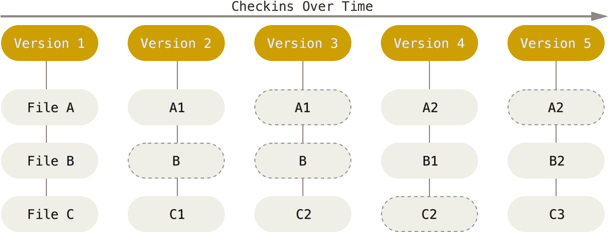
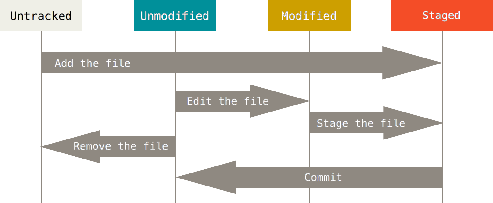
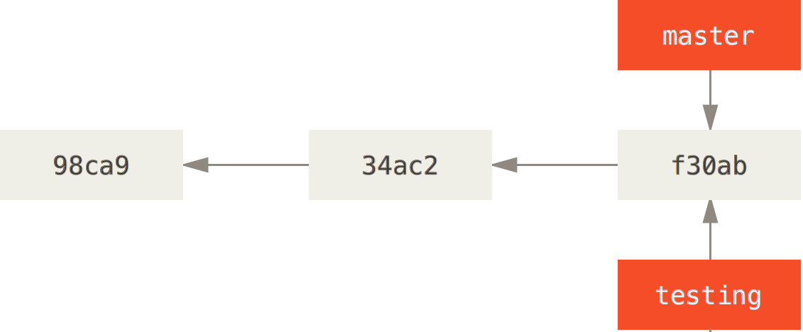
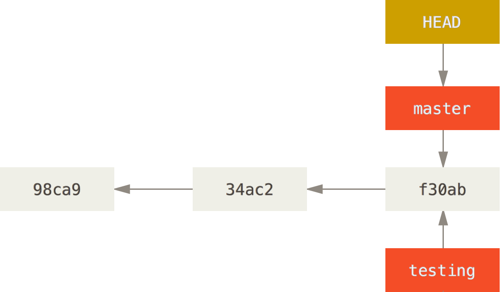
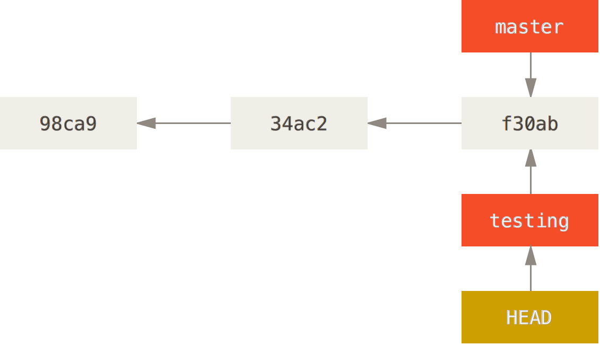
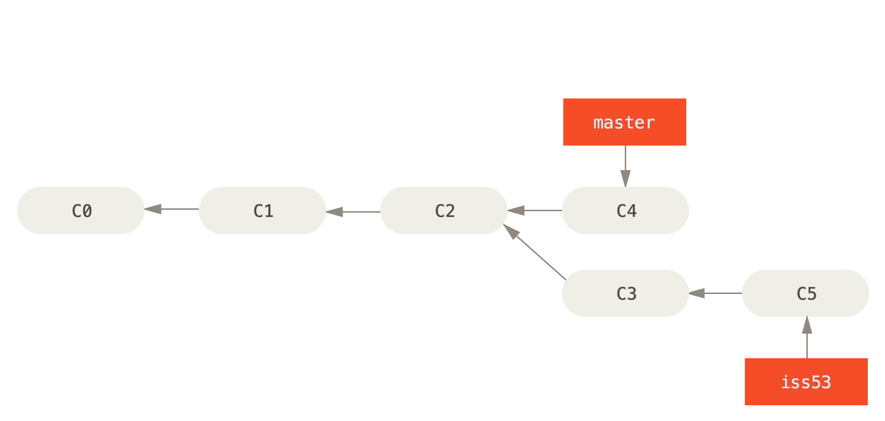

Title         : Introdução ao git(hub)

Sub Title     : R-Users

Author        : Diogo Melo

Affiliation   : IB- USP

Email         : diogro@gmail.com


# O que é o git? 

Um sistema de controle de versão para qualquer tipo de arquivo

* Tipo um track changes on-steroids para sua vida

* Forma de guardar todo o histórico de mudanças de um grupo de arquivos

# Por que um grupo de usuários de *R* começou com git?

* Tudo que nós fazemos no R fica salvo em arquivos de script

* Esse código é alterado ao longo do tempo e essas mudanças frequentemente são perdidas.

# Como guardar versões antigas de um código?

* Opção 1: Salvar um zilhão de arquivos chamados: 

  - script_1.R
  - script_2.R
  - script_2_modificado.R
  - script_2_final.R
  - script_3_finalMESMO.R
  - script_1_denovo_pq_o_3_tava_zuado.R ...

Ou...

*  Opção 2: Usar um sistema de controle de versão


# Ideia geral de controle de versão

* Checkout: versão do arquivo que está acessivel naquele momento


# Como eu consigo um git para chamar de meu?

* Conseguir:

  * Linux: <http://git-scm.com/download/linux>
```
$ sudo apt-get install git
$ sudo yum install git-all
``` 
  * Mac: <http://git-scm.com/download/mac>
  * Windows: <http://git-scm.com/download/win>

* Chamar de meu:

```
$ git config --global user.name "Diogo Melo"
$ git config --global user.email diogro@gmail.com
```

# Commits



* Cada commit guarda o estado de todos os arquivos no repositório em um dado momento

# Seu dia a dia no git


* Stage: colocar as mudanças de um arquivo num commit
* Commit: colocar todas as mudanças que foram "stagged" num commit

# O ciclo de vida de um arquivo no git



# Legal! Mas como eu faço tudo isso?

1. Crie uma pasta para cada projeto (ou use um projeto no RStudio)
2. Navege até essa pasta no terminal/powershell
3. Digite:

```
$ git init
```

Isso vai criar um repositório de git dentro da pasta e todas as mudanças lá dentro vão ser acompanhadas

# Seu dia a dia

1. Edite um arquivo "script.R" (ou vários)
2. No terminal, adicione o arquivo à stagging area:
```
$ git add script.R
```
2. Confere se está tudo certo
```
$ git status
```
3. Faça o commit daquele grupo de mudanças
```
$ git commit
```
  - Vai abrir um editor de texto e pedir um "commmit message", que é um descrição de tudo que mudou com aquele commit. 
  - Faz MUITO BEM descrever direitinho o que vc fez.

# Depois de um tempo...

```
 $ git log --pretty=oneline
d7e09f3de4a7be039da68aad30726aa53ae2890a removing phytools dependency
3f7bc4f3d20e8660e0224aab3673f37b61b77d2e agora vai
25bb9f729935a851c828698e544f953cdc5c5c00 names in var.grad
870b858dfb0a5ec856b7b41be64052c7a75e5aa2 bug in extend matrix
8b915c4f9a32cbfbe106108d88087cb5fe7d326c new install instructions
d8c11e029f3cb55d9039a1febba0ebe9f5c156f7 Better comparison of posteriors
d4de5cd277c1977e74146aa2d4eb1a9d0323290a acctualy fast C++ implementation
2f335ed11bee08ecef6ef4a77a426f5f00120e09 More robust Bootstrap
83b595845a9a68c014bd6dffa3d6df1eb421bd1c Trycatch in montecarlo
8413d73b72b44e68b1b32e435328e61aeb083be7 Nem drift test for 2 populations and minor correction in AncestralStates help
0bd88900c3abe08ccb006c85c31497dfaceaa39b FUCKING MAHALANOBIS CAN GO EAT A FUCKING SQUARED COCK!
fb300f461247a042b1ab49d84ef8846c9d82e576 CRAN changes in imported functions during check.
c6ec70a44ccef2a32ebab9451401b2fb5a291623 fixed bug in ExtendMatrix
...
```

* Podemos também ver exatamente o que mudou em cada versão, a diferença entre duas versões, recuperar versões antigas...
* Tudo que um dia foi colocado num commit pode ser recuperado!

# Mas eu quero usar o github!!11ONZE

![github]

<https://www.github.com/diogro/>

[github]: figures/github_home.png "Version control" { width:600px; vertical-align:middle }

# Depois que criou o repositório

```
$ git clone git@github.com:diogro/MEU_PRIMEIRO_REPO.git
```

* Vai criar uma pasta chamada MEU_PRIMEIRO_REPO já com um repositório git
* Podemos incluir mais arquivos e continuar trabalhando, ocasionalmente mandando mudanças pro servidor

```
$ git pull (pega as mudanças do servidor)
$ git push (manda as mudanças para o servidor)
```

# Branches

* Branches: São "apontadores" para commits específicos
  - O padrão chama "master", mas podia ser qualquer coisa
* Branches permitem que várias versões dos arquivos em um repositório coesistam, e mudanças podem ser compartilhadas e "juntadas".
* Se existe mais de uma cópia de um repositório (local e servidor) cada um tem os seus branches

# Criando um branch

 
```
$ git branch testing
```

# HEAD e checkout

 

* HEAD é quem vc está realmente vendo

# Branches e checkout

 
```
$ git checkout testing
```

# Alterando um branch

 
```
$ vim test.R
$ git commit -a -m 'made a change'
```

# Mudando de branch

 
```
$ git checkout master
```

# Juntando dois branches

Podemos juntar modificações feitas de ponto de partida diferentes fazendo um merge!

 

# Merge 

 

# Merge 


```
$ git checkout master
$ git merge iss53
``` 

* Isso vai juntar as modificações feitas no commit 4 com as feitas nos commits 3 e 5

# Git local e num servidor

* Servidores são cópias do repostório (forks) com seus próprios branches.
* Podemos usar os mesmos comandos localmente e remotamente, especificando o servidor.
```
$ git init
$ git remote add origin git@github.com:diogro/MEU_PRIMEIRO_REPO.git
$ git fetch origin master
$ git merge origin/master
```

* Ou...

```
$ git init
$ git remote add origin git@github.com:diogro/MEU_PRIMEIRO_REPO.git
$ git branch --set-upstream-to=origin/master master
$ git pull
```

# Exemplo ultra prático ao vivo

<https://www.github.com/caetanods/workshop>

# Referências

* O livro, the book, the only book, the book of love, THE GITBOOK
  - <https://git-scm.com/book/en/v2>

* Tutoriais do github
  - <https://guides.github.com/>

* Git e Rstudio
  - <http://r-pkgs.had.co.nz/git.html>
